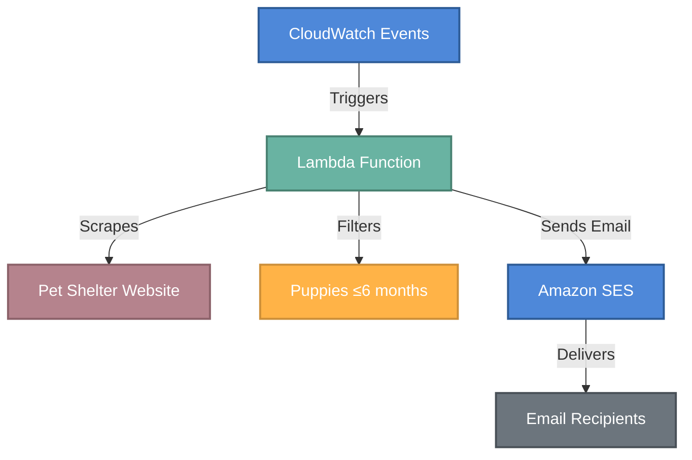

# Puppy Adoption Notifier

A serverless application that automatically checks the Williamson County, TX Pet Shelter website for adoptable puppies (≤6 months old) and sends a daily email report.

## Architecture



The system consists of:

1. **AWS Lambda Function**: Python script that:
   - Scrapes the pet shelter website for available dogs
   - Filters for puppies ≤6 months old
   - Formats and sends an email report

2. **Amazon SES (Simple Email Service)**: Handles email delivery
   - Initially configured in sandbox mode, requiring verified sender/recipient emails

3. **CloudWatch Events**: Triggers the Lambda function on a schedule (runs at 8:00 AM, 12:00 PM, and 3:00 PM CST daily)

4. **IAM Roles & Policies**: Provides necessary permissions for the Lambda function

## Prerequisites

- AWS account with appropriate permissions
- [Terraform](https://www.terraform.io/downloads.html) (v1.0.0+) installed
- [AWS CLI](https://aws.amazon.com/cli/) installed and configured with your credentials
- Valid email addresses for sending and receiving notifications

## Setup Instructions

### 1. Clone the Repository

```bash
git clone https://github.com/jscottcronin/adoptable-dogs
cd puppy-adoption-notifier
```

### 2. Configure Email Addresses

Create a `terraform/terraform.tfvars` file:

```hcl
email_from = "your-verified-sender@example.com"
email_to   = "your-verified-recipient@example.com"
```

### 3. Initialize Terraform

```bash
cd terraform
terraform init
```

### 4. Plan and Apply Infrastructure

```bash
terraform plan
terraform apply
```

Review the planned changes and type `yes` to proceed.

### 5. Verify Email Addresses

Since Amazon SES starts in sandbox mode:
1. Check both email addresses for verification emails from AWS
2. Click the verification links in both emails
3. Wait for verification to complete (usually immediate)

### 6. Test the Lambda Function

1. Go to the AWS Lambda Console
2. Find the "puppy_adoption_lambda" function
3. Click "Test" to run the function manually
4. Check your email for the report

### 7. Monitor Logs

Check CloudWatch Logs for detailed information about the Lambda function's execution:
1. Go to CloudWatch Console
2. Navigate to Log Groups
3. Find the "/aws/lambda/puppy_adoption_lambda" log group

## Schedule Configuration

By default, the Lambda function runs three times daily at 8:00 AM, 12:00 PM, and 3:00 PM CST. To change this schedule:

1. Update the `schedule_expression` variable in `terraform/terraform.tfvars`:
```hcl
schedule_expression = "cron(0 13,17,20 * * ? *)"  # 8am, 12pm, 3pm CST (in UTC)
```

2. Apply the changes:
```bash
terraform apply
```

## Teardown Instructions

To remove all created resources from your AWS account:

```bash
cd terraform
terraform destroy
```

Review the resources to be destroyed and type `yes` to proceed.

## Development

### Adding Features
- The Lambda code is located in the `lambda/` directory
- Modify `puppy_adoption.py` to customize the functionality
- Infrastructure definitions are in the `terraform/` directory

### Troubleshooting
- Check CloudWatch Logs for Lambda function errors
- Verify both email addresses are correctly verified in SES
- Ensure the Lambda function has sufficient permissions via IAM

## Moving to Production

To move beyond SES sandbox limitations:
1. Go to AWS SES Console
2. Click "Request Production Access"
3. Complete the form explaining your email use case
4. Wait for AWS approval (typically 1-2 business days)


